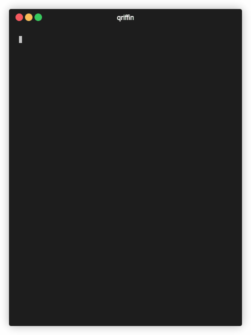

# qriffin

[](https://github.com/kwrush/qriffin/actions)
[](https://www.npmjs.com/package/qriffin)

A small CLI tool to upload file to your Dropbox and create a QR code for the shared link.



## Installation

```console
npm install -g qriffin
```

## How to use

```console
$ qriffin -h
Usage: qriffin [--options] <file>

Options:
  -v, --version          output the version number
  -d, --directory <dir>  specify the directory in Dropbox to save the uploaded file
  -c, --clear            clear the locally stored refresh token and quit the program
  -h, --help             display help for command
```

## License

MIT
